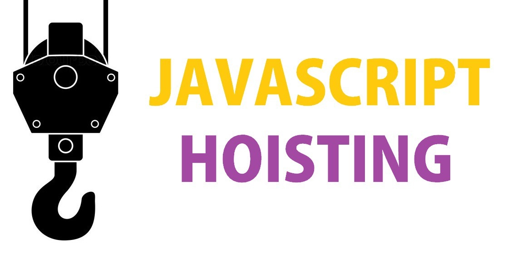

# 호이스팅(Hoisting) 이란



> 호이스팅(Hoisting)은 끌어 올리다 라는 뜻을 가지고 있으며, 함수 안에 있는 변수나 함수 맨위로 끌어 올린다는 것이다.<br>
> 실제로 코드가 끌어올려지는 것은 아니며, 자바스크립트 Parser 가 내부적으로 끌어올려서 처리한다.

쉽게 설명 하자면,

```javascript
var name = 'global 이승환';
 
function name() {  // 함수선언문
	console.log(name);  // 결과는?
	var name = 'local 이승환'; 
};

name();
```

코드에서 출력되는 변수 name 은 'global 이승환'일 거라고 예상하지만, 'local 이승환'이다.<br>
특정 스코프 안에서 선언된 변수`name`는 코드에 적힌 순서와 상관없이 `최상단에서 선언한 것처럼`끌어 올려진다.<br>
이것을 **호이스팅**이라고 한다.

## 1. 호이스팅 대상
var 변수선언과 함수선언문 에서만 **호이스팅**이 일어나며, 변수할당은 올려지지 않는다.<br>
반면 let 과 const 변수선언, 함수표현식에서는 호이스팅이 발생하지 않는다.

## 2. 함수선언문과 함수표현식에서의 호이스팅
> 호이스팅은 함수선언문과 함수표현식에서 서로 다르게 동작하기 때문에 주의해야 한다.

### 2-1. 함수선언문에서의 호이스팅
함수선언문은 코드를 구현한 위치와 관계없이<br>
호이스팅에 따라 브라우저가 자바스크립트를 해석할 때 맨 위로 끌어 올려진다.

### 2-2. 함수표현식에서의 호이스팅
함수표현식은 함수선언문과 달리<br>
선언과 호출 순서에 따라서 정상적으로 함수가 실행되지 않을 수 있다.